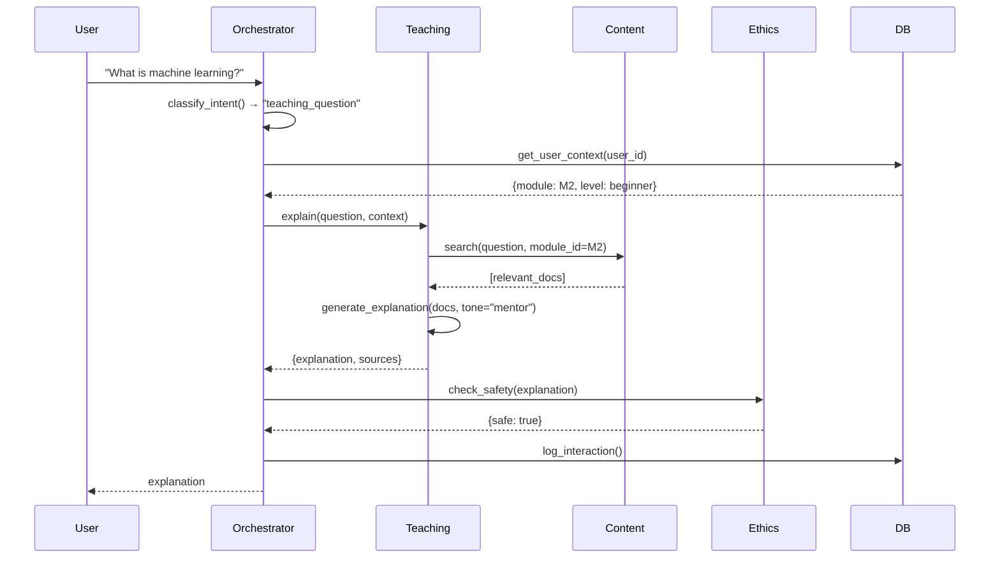
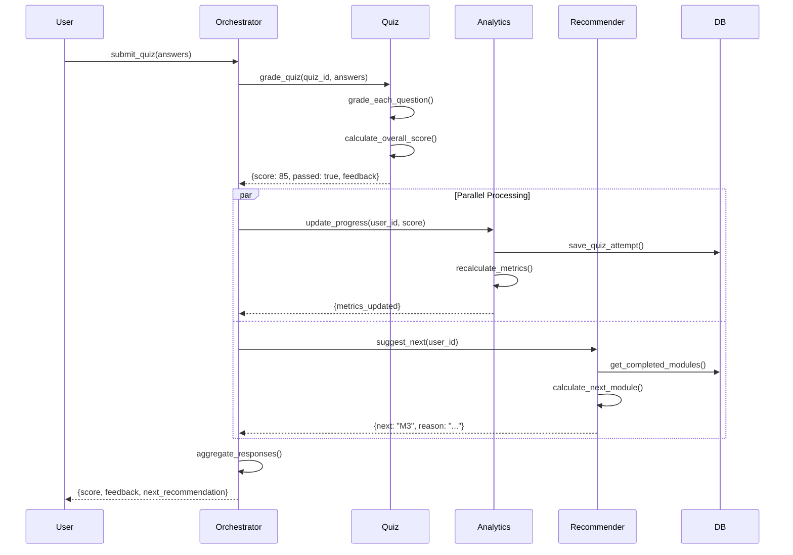
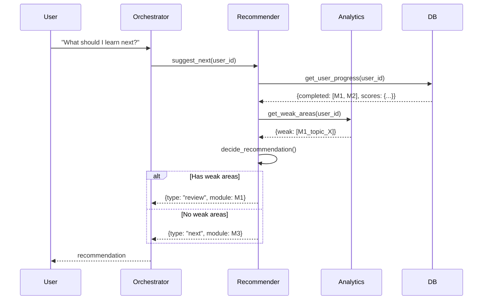
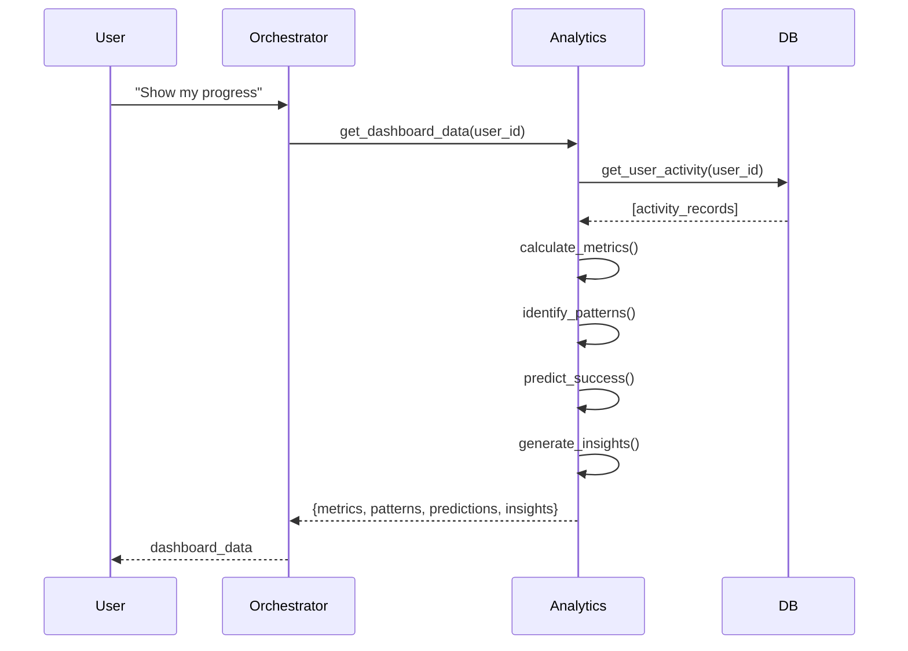

# 🔄 DorjeX AI Tutor - Agent Orchestration & Task Flows

**Date:** 2026-01-04  
**Purpose:** Chi tiết nhiệm vụ và luồng điều phối giữa các agents

---

## 📋 Table of Contents

1. [Agent Task Definitions](#agent-task-definitions)
2. [Orchestration Flows](#orchestration-flows)
3. [State Management](#state-management)
4. [Error Handling](#error-handling)
5. [Performance Optimization](#performance-optimization)

---

## 🎯 Agent Task Definitions

### **1. Orchestrator Agent**

#### **Nhiệm vụ chính:**
```yaml
Responsibilities:
  - Intent classification (phân loại ý định user)
  - Request routing (điều hướng đến agent phù hợp)
  - Response aggregation (tổng hợp responses)
  - Context management (quản lý ngữ cảnh)
  - Error handling & fallback
  - Load balancing (nếu có multiple instances)

Input:
  - user_message: string
  - user_context: {user_id, module_id, session_id, history}
  - metadata: {timestamp, device, language}

Output:
  - agent_route: string (teaching|quiz|recommender|analytics|content|ethics)
  - context_enriched: dict
  - confidence_score: float (0-1)

Decision Logic:
  - Keyword matching (fast path)
  - Intent classification model (fallback)
  - Context-aware routing (based on current module/lesson)
```

#### **Nhiệm vụ cụ thể:**

**Task 1.1: Intent Classification**
```python
def classify_intent(self, message: str, context: dict) -> str:
    """
    Phân loại intent từ user message
    
    Returns:
        - "teaching_question" - Câu hỏi về nội dung
        - "quiz_submit" - Nộp bài quiz
        - "quiz_hint" - Xin gợi ý quiz
        - "recommendation" - Xin gợi ý module tiếp theo
        - "progress_check" - Kiểm tra tiến độ
        - "content_search" - Tìm kiếm nội dung
        - "general_chat" - Chat chung chung
    """
    # Fast path: Keyword matching
    if "quiz" in message.lower() and "submit" in message.lower():
        return "quiz_submit"
    
    if any(word in message.lower() for word in ["what", "how", "why", "explain"]):
        return "teaching_question"
    
    if "next" in message.lower() or "recommend" in message.lower():
        return "recommendation"
    
    # Slow path: ML classification
    return self.intent_classifier.predict(message, context)
```

**Task 1.2: Context Enrichment**
```python
def enrich_context(self, user_id: str, module_id: str) -> dict:
    """
    Làm giàu context với thông tin từ DB
    """
    return {
        "user_profile": self.db.get_user_profile(user_id),
        "current_module": self.db.get_module(module_id),
        "progress": self.db.get_user_progress(user_id),
        "recent_activity": self.db.get_recent_activity(user_id, limit=5),
        "weak_areas": self.analytics_agent.get_weak_areas(user_id)
    }
```

**Task 1.3: Agent Routing**
```python
def route_to_agent(self, intent: str, context: dict) -> Agent:
    """
    Route request đến agent phù hợp
    """
    routing_map = {
        "teaching_question": self.teaching_agent,
        "quiz_submit": self.quiz_agent,
        "quiz_hint": self.quiz_agent,
        "recommendation": self.recommender_agent,
        "progress_check": self.analytics_agent,
        "content_search": self.content_agent
    }
    
    agent = routing_map.get(intent, self.teaching_agent)  # Default to teaching
    return agent
```

---

### **2. Teaching Agent**

#### **Nhiệm vụ chính:**
```yaml
Responsibilities:
  - Explain concepts (giải thích khái niệm)
  - Answer questions (trả lời câu hỏi)
  - Provide examples (đưa ví dụ)
  - Adaptive explanations (điều chỉnh theo level)
  - Use reflex tone (áp dụng tone từ reflex mapping)

Input:
  - question: string
  - context: {module_id, lesson_id, user_level, conversation_history}
  - tone: string (genZ|mentor|professor)

Output:
  - explanation: string (markdown format)
  - examples: list[string]
  - related_topics: list[string]
  - confidence: float

Tools:
  - GPT-4 (primary LLM)
  - Pinecone (vector search for RAG)
  - Reflex mapping files (tone customization)
```

#### **Nhiệm vụ cụ thể:**

**Task 2.1: Retrieve Relevant Content (RAG)**
```python
def retrieve_context(self, question: str, module_id: str) -> list[Document]:
    """
    Tìm nội dung liên quan từ lessons
    """
    # 1. Vector search
    query_embedding = self.embeddings.embed_query(question)
    
    # 2. Search with filters
    results = self.vector_store.similarity_search(
        query_embedding,
        filter={"module_id": module_id},
        k=3  # Top 3 most relevant
    )
    
    return results
```

**Task 2.2: Generate Explanation**
```python
def explain(self, question: str, context: dict) -> dict:
    """
    Tạo explanation dựa trên RAG + reflex tone
    """
    # 1. Get relevant content
    docs = self.retrieve_context(question, context["module_id"])
    
    # 2. Get reflex tone
    reflex = self.reflex_mappings[context["module_id"]]
    tone = reflex.get("tone", "mentor")
    
    # 3. Build prompt
    prompt = f"""
    You are a {tone} AI tutor teaching {context["module_id"]}.
    
    Context from lessons:
    {self.format_docs(docs)}
    
    Student question: {question}
    Student level: {context["user_level"]}
    
    Provide a clear, {tone}-style explanation.
    Include 1-2 examples if helpful.
    """
    
    # 4. Generate response
    response = self.llm.invoke(prompt)
    
    return {
        "explanation": response.content,
        "sources": [doc.metadata for doc in docs],
        "tone_used": tone
    }
```

**Task 2.3: Adaptive Difficulty**
```python
def adjust_explanation_level(self, explanation: str, user_level: str) -> str:
    """
    Điều chỉnh độ khó của explanation
    """
    if user_level == "beginner":
        prompt = f"""
        Simplify this explanation for a complete beginner:
        {explanation}
        
        Use simple language, avoid jargon, add analogies.
        """
    elif user_level == "advanced":
        prompt = f"""
        Make this explanation more technical:
        {explanation}
        
        Add technical details, formulas, advanced concepts.
        """
    else:
        return explanation  # Intermediate - no change
    
    return self.llm.invoke(prompt).content
```

---

### **3. Quiz Agent**

#### **Nhiệm vụ chính:**
```yaml
Responsibilities:
  - Grade answers (chấm bài)
  - Provide feedback (đưa feedback)
  - Give hints (gợi ý không spoil)
  - Identify mistakes (chỉ ra lỗi sai)
  - Generate similar questions (tạo câu hỏi tương tự)

Input:
  - quiz_id: string
  - answers: dict[question_id, user_answer]
  - context: {user_id, module_id}

Output:
  - score: int (0-100)
  - feedback: dict[question_id, feedback_text]
  - passed: bool (score >= 80)
  - weak_topics: list[string]

Tools:
  - Rule-based grading (for multiple choice)
  - GPT-4 (for open-ended questions)
  - Quiz YAML files
```

#### **Nhiệm vụ cụ thể:**

**Task 3.1: Grade Multiple Choice**
```python
def grade_multiple_choice(self, question: dict, user_answer: str) -> dict:
    """
    Chấm câu hỏi trắc nghiệm (rule-based)
    """
    is_correct = user_answer.lower() == question["correct_answer"].lower()
    
    return {
        "correct": is_correct,
        "score": 100 if is_correct else 0,
        "explanation": question["explanation"],
        "correct_answer": question["correct_answer"] if not is_correct else None
    }
```

**Task 3.2: Grade Open-Ended**
```python
def grade_open_ended(self, question: dict, user_answer: str) -> dict:
    """
    Chấm câu hỏi tự luận (LLM-based)
    """
    prompt = f"""
    You are grading a student's answer.
    
    Question: {question["text"]}
    Model answer: {question["correct_answer"]}
    Student answer: {user_answer}
    
    Grade the answer on a scale of 0-100 based on:
    - Correctness (50%)
    - Completeness (30%)
    - Clarity (20%)
    
    Provide:
    1. Score (0-100)
    2. Feedback (what's good, what's missing)
    3. Suggestions for improvement
    
    Format as JSON.
    """
    
    response = self.llm.invoke(prompt)
    result = json.loads(response.content)
    
    return {
        "correct": result["score"] >= 70,
        "score": result["score"],
        "feedback": result["feedback"],
        "suggestions": result["suggestions"]
    }
```

**Task 3.3: Provide Hints**
```python
def give_hint(self, question: dict, user_attempt: str) -> str:
    """
    Đưa gợi ý không spoil answer
    """
    prompt = f"""
    A student is struggling with this question:
    {question["text"]}
    
    Their attempt: {user_attempt}
    
    Provide a helpful hint that:
    - Points them in the right direction
    - Does NOT give away the answer
    - Addresses their specific mistake
    
    Keep it under 50 words.
    """
    
    return self.llm.invoke(prompt).content
```

**Task 3.4: Calculate Overall Score**
```python
def calculate_quiz_score(self, quiz_results: list[dict]) -> dict:
    """
    Tính điểm tổng và xác định pass/fail
    """
    total_score = sum(r["score"] for r in quiz_results)
    avg_score = total_score / len(quiz_results)
    
    # Identify weak topics
    weak_topics = [
        r["topic"] for r in quiz_results 
        if r["score"] < 70
    ]
    
    return {
        "score": round(avg_score),
        "passed": avg_score >= 80,
        "total_questions": len(quiz_results),
        "correct_answers": sum(1 for r in quiz_results if r["correct"]),
        "weak_topics": list(set(weak_topics))
    }
```

---

### **4. Recommender Agent**

#### **Nhiệm vụ chính:**
```yaml
Responsibilities:
  - Suggest next module/lesson
  - Personalize learning path
  - Identify knowledge gaps
  - Recommend review topics
  - Adaptive difficulty progression

Input:
  - user_id: string
  - current_progress: dict
  - quiz_scores: list[dict]

Output:
  - next_module: string
  - reason: string
  - alternative_paths: list[string]
  - review_topics: list[string]

Tools:
  - Collaborative filtering
  - Module dependency graph
  - User progress data
```

#### **Nhiệm vụ cụ thể:**

**Task 4.1: Identify Next Module**
```python
def suggest_next_module(self, user_id: str) -> dict:
    """
    Gợi ý module tiếp theo dựa trên progress
    """
    # 1. Get completed modules
    progress = self.db.get_user_progress(user_id)
    completed = [p.module_id for p in progress if p.completed]
    
    # 2. Get module dependencies
    dependencies = self.load_module_dependencies()
    
    # 3. Find available modules (dependencies met)
    available = [
        m for m in dependencies 
        if all(dep in completed for dep in dependencies[m]["requires"])
        and m not in completed
    ]
    
    # 4. Rank by difficulty and user level
    user_level = self.db.get_user_profile(user_id).level
    ranked = self.rank_modules(available, user_level)
    
    return {
        "next_module": ranked[0] if ranked else None,
        "reason": f"Based on your progress, this is the next logical step",
        "alternatives": ranked[1:3] if len(ranked) > 1 else []
    }
```

**Task 4.2: Identify Knowledge Gaps**
```python
def identify_gaps(self, user_id: str) -> list[dict]:
    """
    Tìm các chỗ yếu cần ôn lại
    """
    # 1. Get quiz history
    quiz_attempts = self.db.get_quiz_attempts(user_id)
    
    # 2. Find topics with low scores
    gaps = []
    for attempt in quiz_attempts:
        if attempt.score < 80:
            gaps.append({
                "module_id": attempt.module_id,
                "score": attempt.score,
                "topics": attempt.weak_topics,
                "last_attempt": attempt.attempted_at
            })
    
    # 3. Sort by priority (lowest score first)
    gaps.sort(key=lambda x: x["score"])
    
    return gaps[:3]  # Top 3 gaps
```

**Task 4.3: Personalize Learning Path**
```python
def create_learning_path(self, user_id: str, goal: str) -> list[str]:
    """
    Tạo learning path cá nhân hóa
    """
    # 1. Get user profile
    profile = self.db.get_user_profile(user_id)
    
    # 2. Define goal-based paths
    paths = {
        "ai_fundamentals": ["M1", "M2", "M3"],
        "prompt_engineering": ["M1", "M4", "M5", "M7"],
        "ai_applications": ["M1", "M2", "M19", "M20", "M21"],
        "full_program": [f"M{i}" for i in range(1, 24)]
    }
    
    # 3. Get base path
    base_path = paths.get(goal, paths["full_program"])
    
    # 4. Remove completed modules
    completed = self.get_completed_modules(user_id)
    remaining = [m for m in base_path if m not in completed]
    
    return remaining
```

---

### **5. Analytics Agent**

#### **Nhiệm vụ chính:**
```yaml
Responsibilities:
  - Track learning progress
  - Calculate metrics (completion rate, avg score, time spent)
  - Identify patterns (learning style, peak hours)
  - Predict success probability
  - Generate insights & recommendations

Input:
  - user_id: string
  - time_range: string (week|month|all)

Output:
  - metrics: dict
  - insights: list[string]
  - predictions: dict
  - recommendations: list[string]

Tools:
  - Pandas (data analysis)
  - Scikit-learn (predictions)
  - Time series analysis
```

#### **Nhiệm vụ cụ thể:**

**Task 5.1: Calculate Metrics**
```python
def calculate_metrics(self, user_id: str, time_range: str = "all") -> dict:
    """
    Tính các metrics cơ bản
    """
    # 1. Get user activity data
    activity = self.db.get_user_activity(user_id, time_range)
    
    # 2. Calculate metrics
    metrics = {
        "completion_rate": self._calc_completion_rate(activity),
        "avg_quiz_score": self._calc_avg_score(activity),
        "time_spent_hours": self._calc_time_spent(activity),
        "streak_days": self._calc_streak(activity),
        "modules_completed": len([a for a in activity if a.completed]),
        "lessons_viewed": len([a for a in activity if a.type == "lesson"]),
        "quizzes_taken": len([a for a in activity if a.type == "quiz"])
    }
    
    return metrics

def _calc_completion_rate(self, activity: list) -> float:
    """Tỷ lệ hoàn thành"""
    total_modules = 23
    completed = len([a for a in activity if a.completed])
    return round(completed / total_modules * 100, 1)

def _calc_avg_score(self, activity: list) -> float:
    """Điểm trung bình quiz"""
    quiz_scores = [a.score for a in activity if a.type == "quiz"]
    return round(sum(quiz_scores) / len(quiz_scores), 1) if quiz_scores else 0

def _calc_streak(self, activity: list) -> int:
    """Số ngày học liên tục"""
    dates = sorted(set(a.date for a in activity))
    streak = 1
    for i in range(len(dates) - 1):
        if (dates[i+1] - dates[i]).days == 1:
            streak += 1
        else:
            break
    return streak
```

**Task 5.2: Identify Patterns**
```python
def identify_patterns(self, user_id: str) -> dict:
    """
    Phát hiện patterns trong học tập
    """
    activity = self.db.get_user_activity(user_id)
    
    # 1. Peak learning hours
    hours = [a.timestamp.hour for a in activity]
    peak_hour = max(set(hours), key=hours.count)
    
    # 2. Preferred content type
    types = [a.type for a in activity]
    preferred_type = max(set(types), key=types.count)
    
    # 3. Learning pace
    days_active = len(set(a.date for a in activity))
    modules_completed = len([a for a in activity if a.completed])
    pace = modules_completed / days_active if days_active > 0 else 0
    
    return {
        "peak_hour": peak_hour,
        "preferred_type": preferred_type,
        "learning_pace": round(pace, 2),  # modules per day
        "consistency": self._calc_consistency(activity)
    }
```

**Task 5.3: Predict Success**
```python
def predict_success(self, user_id: str) -> dict:
    """
    Dự đoán khả năng hoàn thành chương trình
    """
    # 1. Get features
    metrics = self.calculate_metrics(user_id)
    patterns = self.identify_patterns(user_id)
    
    features = [
        metrics["completion_rate"],
        metrics["avg_quiz_score"],
        metrics["streak_days"],
        patterns["learning_pace"],
        patterns["consistency"]
    ]
    
    # 2. Predict using trained model
    success_prob = self.success_model.predict_proba([features])[0][1]
    
    # 3. Generate insights
    if success_prob > 0.8:
        insight = "You're on track to complete the program!"
    elif success_prob > 0.5:
        insight = "Keep up the good work. Stay consistent!"
    else:
        insight = "Consider increasing your learning pace."
    
    return {
        "success_probability": round(success_prob, 2),
        "insight": insight,
        "recommended_pace": self._calc_recommended_pace(user_id)
    }
```

---

### **6. Content Agent**

#### **Nhiệm vụ chính:**
```yaml
Responsibilities:
  - Search lessons/quizzes
  - Summarize content
  - Generate practice questions
  - Extract key concepts
  - Content recommendations

Input:
  - query: string
  - filters: dict (module_id, difficulty, type)

Output:
  - results: list[Document]
  - summary: string
  - key_concepts: list[string]

Tools:
  - Vector search (Pinecone)
  - GPT-3.5 (summarization)
  - Markdown parser
```

#### **Nhiệm vụ cụ thể:**

**Task 6.1: Search Content**
```python
def search(self, query: str, filters: dict = None) -> list[dict]:
    """
    Tìm kiếm nội dung
    """
    # 1. Vector search
    results = self.vector_store.similarity_search(
        query,
        filter=filters,
        k=10
    )
    
    # 2. Re-rank by relevance
    ranked = self.rerank(query, results)
    
    return [
        {
            "module_id": r.metadata["module_id"],
            "lesson_id": r.metadata["lesson_id"],
            "title": r.metadata["title"],
            "excerpt": r.page_content[:200],
            "relevance_score": r.score
        }
        for r in ranked[:5]
    ]
```

**Task 6.2: Summarize Lesson**
```python
def summarize(self, lesson_id: str, length: str = "medium") -> str:
    """
    Tóm tắt lesson
    """
    # 1. Get lesson content
    lesson = self.db.get_lesson(lesson_id)
    
    # 2. Determine summary length
    max_words = {
        "short": 50,
        "medium": 150,
        "long": 300
    }[length]
    
    # 3. Generate summary
    prompt = f"""
    Summarize this lesson in {max_words} words or less:
    
    {lesson.content}
    
    Focus on key concepts and main takeaways.
    """
    
    return self.llm.invoke(prompt).content
```

**Task 6.3: Generate Practice Questions**
```python
def generate_practice_questions(self, module_id: str, count: int = 5) -> list[dict]:
    """
    Tạo câu hỏi luyện tập
    """
    # 1. Get module content
    lessons = self.db.get_module_lessons(module_id)
    content = "\n\n".join([l.content for l in lessons])
    
    # 2. Generate questions
    prompt = f"""
    Based on this content, generate {count} practice questions:
    
    {content[:2000]}  # Truncate to avoid token limit
    
    For each question:
    - Make it challenging but fair
    - Include 4 options (A, B, C, D)
    - Mark the correct answer
    - Provide a brief explanation
    
    Format as JSON array.
    """
    
    response = self.llm.invoke(prompt)
    questions = json.loads(response.content)
    
    return questions
```

---

### **7. Ethics Agent**

#### **Nhiệm vụ chính:**
```yaml
Responsibilities:
  - Content safety check
  - Bias detection
  - Age-appropriate filtering
  - GDPR compliance
  - Refusal handling

Input:
  - content: string
  - context: dict

Output:
  - safe: bool
  - issues: list[string]
  - filtered_content: string (if needed)

Tools:
  - OpenAI Moderation API
  - Custom safety rules
  - Ethics sandbox (từ DorjeX v2.4)
```

#### **Nhiệm vụ cụ thể:**

**Task 7.1: Safety Check**
```python
def check_safety(self, content: str) -> dict:
    """
    Kiểm tra an toàn nội dung
    """
    # 1. OpenAI Moderation
    moderation = openai.Moderation.create(input=content)
    result = moderation.results[0]
    
    # 2. Custom rules
    custom_issues = []
    if self._contains_personal_info(content):
        custom_issues.append("Contains personal information")
    
    if self._contains_inappropriate_language(content):
        custom_issues.append("Inappropriate language")
    
    # 3. Aggregate results
    return {
        "safe": not result.flagged and len(custom_issues) == 0,
        "issues": result.categories + custom_issues,
        "action": "block" if result.flagged else "allow"
    }
```

**Task 7.2: Bias Detection**
```python
def detect_bias(self, content: str) -> dict:
    """
    Phát hiện bias trong nội dung
    """
    # Check for biased language
    bias_indicators = {
        "gender": ["he always", "she always", "men are", "women are"],
        "racial": ["all X people", "X people are"],
        "age": ["old people", "young people always"]
    }
    
    detected_biases = []
    for bias_type, indicators in bias_indicators.items():
        if any(ind in content.lower() for ind in indicators):
            detected_biases.append(bias_type)
    
    return {
        "has_bias": len(detected_biases) > 0,
        "bias_types": detected_biases,
        "severity": "high" if len(detected_biases) > 2 else "low"
    }
```

---

## 🔄 Orchestration Flows

### **Flow 1: Student asks a teaching question**



**Code Implementation:**
```python
async def handle_teaching_question(self, message: str, user_id: str):
    # 1. Classify intent
    intent = self.classify_intent(message)
    assert intent == "teaching_question"
    
    # 2. Get context
    context = await self.db.get_user_context(user_id)
    
    # 3. Route to teaching agent
    explanation = await self.teaching_agent.explain(message, context)
    
    # 4. Safety check (parallel)
    safety_check = await self.ethics_agent.check_safety(explanation["explanation"])
    
    if not safety_check["safe"]:
        return {"error": "Content filtered for safety"}
    
    # 5. Log interaction
    await self.db.log_interaction(user_id, message, explanation)
    
    # 6. Return response
    return explanation
```

---

### **Flow 2: Student submits quiz**



**Code Implementation:**
```python
async def handle_quiz_submission(self, quiz_id: str, answers: dict, user_id: str):
    # 1. Grade quiz
    quiz_result = await self.quiz_agent.grade_quiz(quiz_id, answers)
    
    # 2. Parallel processing
    analytics_task = asyncio.create_task(
        self.analytics_agent.update_progress(user_id, quiz_result)
    )
    
    recommender_task = asyncio.create_task(
        self.recommender_agent.suggest_next(user_id)
    )
    
    # 3. Wait for both
    analytics_result, recommendation = await asyncio.gather(
        analytics_task,
        recommender_task
    )
    
    # 4. Aggregate response
    return {
        "quiz_result": quiz_result,
        "updated_metrics": analytics_result,
        "next_recommendation": recommendation
    }
```

---

### **Flow 3: Student requests recommendation**



**Code Implementation:**
```python
async def handle_recommendation_request(self, user_id: str):
    # 1. Get weak areas
    weak_areas = await self.analytics_agent.get_weak_areas(user_id)
    
    # 2. Decide: review or next?
    if weak_areas:
        recommendation = {
            "type": "review",
            "module": weak_areas[0]["module_id"],
            "reason": f"You scored {weak_areas[0]['score']}% on this module. Let's review!",
            "topics": weak_areas[0]["topics"]
        }
    else:
        next_module = await self.recommender_agent.suggest_next(user_id)
        recommendation = {
            "type": "next",
            "module": next_module["module_id"],
            "reason": next_module["reason"]
        }
    
    return recommendation
```

---

### **Flow 4: Student checks progress**



**Code Implementation:**
```python
async def handle_progress_check(self, user_id: str):
    # 1. Get all analytics data
    dashboard = await self.analytics_agent.get_dashboard_data(user_id)
    
    # Dashboard includes:
    # - metrics (completion rate, avg score, time spent, streak)
    # - patterns (peak hours, learning pace, consistency)
    # - predictions (success probability, recommended pace)
    # - insights (personalized messages)
    
    return dashboard
```

---

## 🗄️ State Management

### **Conversation State**
```python
class ConversationState:
    """
    Quản lý state của conversation
    """
    def __init__(self):
        self.user_id: str
        self.session_id: str
        self.current_module: str
        self.current_lesson: str
        self.conversation_history: list[Message]
        self.context: dict
        self.last_intent: str
        self.last_agent: str
    
    def update(self, message: Message, response: Response):
        """Update state after each interaction"""
        self.conversation_history.append(message)
        self.conversation_history.append(response)
        self.last_intent = message.intent
        self.last_agent = response.agent
    
    def get_context(self) -> dict:
        """Get current context for agents"""
        return {
            "user_id": self.user_id,
            "module_id": self.current_module,
            "lesson_id": self.current_lesson,
            "history": self.conversation_history[-5:],  # Last 5 messages
            "last_intent": self.last_intent
        }
```

### **State Storage**
```python
# Redis for session state
class StateManager:
    def __init__(self):
        self.redis = Redis(host='localhost', port=6379)
    
    def save_state(self, session_id: str, state: ConversationState):
        """Save state to Redis"""
        self.redis.setex(
            f"session:{session_id}",
            3600,  # 1 hour TTL
            json.dumps(state.to_dict())
        )
    
    def load_state(self, session_id: str) -> ConversationState:
        """Load state from Redis"""
        data = self.redis.get(f"session:{session_id}")
        if data:
            return ConversationState.from_dict(json.loads(data))
        return ConversationState()  # New state
```

---

## ⚠️ Error Handling

### **Agent Fallback Chain**
```python
class OrchestratorAgent:
    def handle_with_fallback(self, message: str, context: dict):
        """
        Handle request với fallback chain
        """
        try:
            # Try primary agent
            return self.route_to_agent(message, context)
        except AgentError as e:
            logger.error(f"Primary agent failed: {e}")
            
            # Fallback to teaching agent
            try:
                return self.teaching_agent.respond(message, context)
            except Exception as e2:
                logger.error(f"Fallback agent failed: {e2}")
                
                # Final fallback: canned response
                return {
                    "response": "I'm having trouble right now. Please try again later.",
                    "error": True
                }
```

### **Timeout Handling**
```python
async def handle_with_timeout(self, agent_func, timeout=10):
    """
    Execute agent function với timeout
    """
    try:
        return await asyncio.wait_for(agent_func(), timeout=timeout)
    except asyncio.TimeoutError:
        logger.warning(f"Agent timeout after {timeout}s")
        return {
            "response": "This is taking longer than expected. Let me simplify...",
            "timeout": True
        }
```

---

## ⚡ Performance Optimization

### **Caching Strategy**
```python
class CacheManager:
    def __init__(self):
        self.redis = Redis()
    
    def cache_response(self, key: str, response: dict, ttl=3600):
        """Cache agent response"""
        self.redis.setex(
            f"cache:{key}",
            ttl,
            json.dumps(response)
        )
    
    def get_cached(self, key: str) -> dict:
        """Get cached response"""
        data = self.redis.get(f"cache:{key}")
        return json.loads(data) if data else None
    
    def generate_cache_key(self, message: str, context: dict) -> str:
        """Generate cache key"""
        # Hash message + module_id
        return hashlib.md5(
            f"{message}:{context.get('module_id')}".encode()
        ).hexdigest()
```

### **Parallel Processing**
```python
async def process_parallel(self, tasks: list):
    """
    Process multiple agent tasks in parallel
    """
    results = await asyncio.gather(*tasks, return_exceptions=True)
    
    # Filter out exceptions
    valid_results = [r for r in results if not isinstance(r, Exception)]
    
    return valid_results
```

---

## 📝 Summary

### **7 Agents với nhiệm vụ rõ ràng:**
1. **Orchestrator** - Routing & coordination
2. **Teaching** - Explain & answer questions
3. **Quiz** - Grade & feedback
4. **Recommender** - Personalization
5. **Analytics** - Metrics & insights
6. **Content** - Search & summarization
7. **Ethics** - Safety & compliance

### **4 Main Flows:**
1. Teaching question → Teaching + Content + Ethics
2. Quiz submission → Quiz + Analytics + Recommender
3. Recommendation request → Recommender + Analytics
4. Progress check → Analytics

### **Key Features:**
- ✅ Clear task definitions
- ✅ Parallel processing
- ✅ State management (Redis)
- ✅ Error handling & fallbacks
- ✅ Caching for performance
- ✅ Comprehensive logging

---

**Ready to implement! 🚀**
